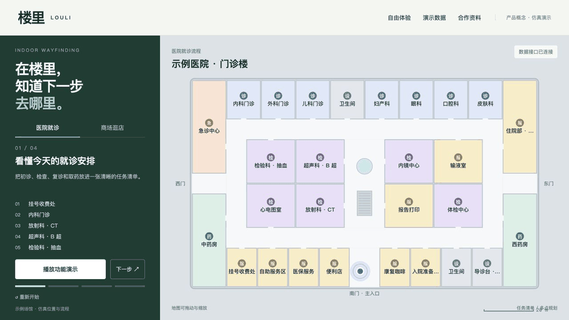

# 楼里 · 产品展示与数据接口

医院与商场各有四段展示：任务清单、动态路线、模拟排队返回提醒、信标概念。首页适合给队友或合作方讲解；“自由体验”保留搜索、地点详情、多点规划和定位方法仿真；“演示数据”支持导入、下载场馆包与修改模拟队列。

## 附近场馆展示

默认展示 **杭州城西银泰城**，用户提供的室外锚点距紫金港约1.55公里（直线），是两家商场中较近的一家。“附近场馆”收录两家商场和四个医院院区，可切换西溪印象城；医院目前仅展示地点资料。

真实地址和室外坐标来自用户提供的地图研究资料，未重新实地核验。**附件不含实际楼层图**；两家商场的室内几何、设施、商铺、位置与队列均为示意。地图尺度和路线距离是仿真数值，不是实际场馆测量。完整说明见 [附近场馆接入](docs/nearby-venues.md)。

## 展示材料

- [城西银泰四章节演示 GIF](materials/media/yintai-demo.gif)、[展示截图](materials/media/yintai-showcase.png)


- [医院功能 GIF](materials/media/hospital-demo.gif) / [商场功能 GIF](materials/media/mall-demo.gif)
- [硬件设计 PDF](materials/hardware/hardware-design.pdf)、[BOM](materials/hardware/BOM.csv)、[概念图](materials/hardware/concept.png)、[爆炸图](materials/hardware/exploded.png)
- [简版商业计划 PDF](materials/business/louli-business-plan.pdf)、[商业调研与访谈 PDF](materials/business/louli-commercial-research.pdf)
- PDF旁附可编辑LaTeX源稿。早期概念讨论稿在 `materials/archive/`，本轮状态以本README和验收记录为准。



原单文件演示保留在 [demo/index.html](demo/index.html)，旧商业报告在 [report/index.html](report/index.html)；原README保留为 [历史说明](docs/legacy-readme.md)，其中旧参数与测算不能视为当前实测或商业承诺。

## 启动

需要 Python 3.9 或更新版本，无需安装第三方包。在本目录执行：

```sh
python3 backend/server.py
```

打开 http://127.0.0.1:8791/ 。Mac 也可双击 `start.command`，终端需保持开启。端口被占用时，使用 `python3 backend/server.py --port 8792` 并打开对应地址。

后端默认只在本机运行。首次启动自动载入内置医院与商场；SQLite 数据位于 `backend/runtime/demo.sqlite`。重新启动会保留导入场馆和队列，数据管理页可恢复内置种子。

## 三分钟讲解

1. 选“医院就诊”，说明患者从目的地查找走向任务流程导航；点击“播放功能演示”。每段约12秒，也可“下一步”或点进度条跳转。
2. 在路线章节说明地标指引；在候诊章节说明返回提醒。所有位置、号码与队列都是演示数据，未连接业务系统。
3. 切到“商场展示”，展示多点清单与路线。自由体验内可搜索、选择地点与规划访问顺序。
4. 打开“合作资料”，讨论一层地图、一个流程、一个业务负责人的小范围试点。先确认对方的问题与资源，再谈正式报价。

演示的排队章节会把对应地点队列写成1，以说明接口变化；“重新开始”或切换场景会恢复进入该场馆时的队列。直接关闭页面后，可在数据页恢复种子。模拟号码只存在当前页面，没有真实预约或叫号效力。

## 给我们一个假数据包

先下载数据页内的商场、医院或自定义样例，修改后上传或粘贴，点击“验证并导入”，再打开该场馆展示。`examples/custom-map.json` 使用60×40米、三处全新编号地点，演示尺寸与几何真正随导入改变。

格式、端点和示例请求见 [接口说明](docs/api.md)。目前接受约定 JSON：单层米制地图、矩形房间、走廊、门点、地点资料、任务流程与队列。真实西溪银泰等地图需要场馆授权、尺寸标定和几何转换；CAD、图片、GeoJSON不能直接作为此数据包上传。

## 给前端协作者

`frontend/` 是独立静态前端，不引用后端源码，没有构建依赖。主页面 `index.html`、自由体验 `demo.html`、数据页 `data-console.html` 分开；样式在 `styles/`，脚本在 `js/`。`api.js` 是唯一网络接口封装，使用同源 `/api/v1`。如果使用另一台开发服务器，需要把 `/api/v1` 代理到 Python 服务。

`bootstrap.js` 先加载场馆包，再按顺序挂载仿真文件。原算法按职责拆成 geometry、routing、positioning、simulation、navigation、queues、planner、renderers 等文件；这些传统脚本仍共享页面作用域，尚未重写成框架组件。展示页通过 `LouliDemo` 小接口操作地图。新页面可独立优化，避免打乱仿真加载顺序。

内置医院、商场、城西银泰和西溪印象城可在接口不可用时读静态种子。独立静态演示可在 `frontend/` 执行 `python3 -m http.server 8792`；地图导入、数据管理和持久化需要后端。浏览器网页没有连接手机真实蓝牙定位。

## 验证

```sh
python3 -m unittest discover -s tests -v
node --test frontend/js/core.test.mjs
```

后端20项、前端10项测试通过。浏览器验证了医院/商场播放、暂停、重置、章节、动态路线、资料弹窗、60×40米新地图导入与导航；390px手机页面无横向溢出。见 [验收记录](docs/acceptance.md)。

## 来源与交付边界

本项目基于 https://github.com/chinayuren2022-2025/louli-indoor-nav 的 `demo/louli.html` 仿真拆分并新增展示页和后端。保留来源记录；本包未另行授予原仓库许可。代码与展示材料可在本仓库继续维护。

真实完成：本地页面、HTTP接口、SQLite存储、数据导入、队列读写与仿真路线。概念阶段：自研硬件、实地定位、跨楼层、业务系统对接和正式现场交付。模拟输出不能作为定位精度或运营改善的实测证据。
